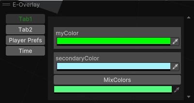
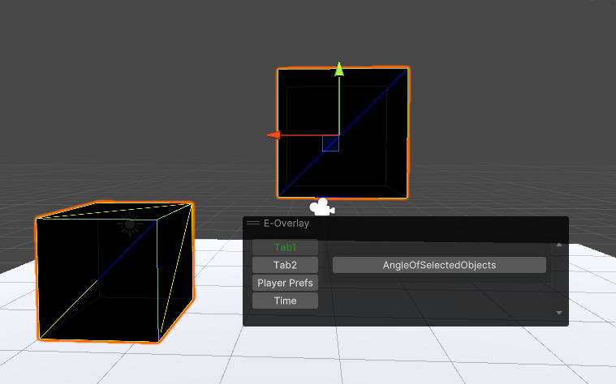
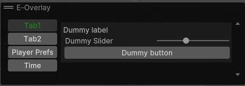
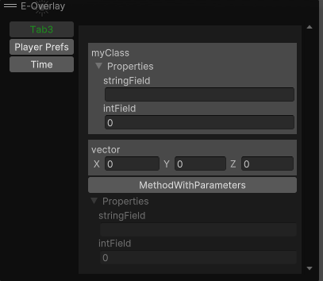

# EOverlays

EOverlays is a editor tool for Unity 3D game engine to write custom editor tools & utilities. 
EOverlay uses Overlays at Unity (you can discover overlays from [this link](https://docs.unity3d.com/Manual/overlays.html)).

# Support

EOverlays is an open-source project that I am developing in my free time. If you like it you can support me by donating.

<a href="https://www.buymeacoffee.com/erdemkly"></a>

## Installation

### Git

For git installation you need to know git link (https://github.com/erdemkly/EOverlays.git)
Paste this link to<br>
<b>Window -> Package Manager -> + -> Add package from git url -> [Paste link here] -> Add</b><br>
(The location of this feature may vary depending on the Unity version. I am using version 2021.3.21f1 of the Unity game engine.)

### Install via OpenUPM

[](https://openupm.com/packages/com.erdem.overlays/)
[](https://openupm.com/packages/com.erdem.overlays/)

The package is available on the [openupm registry](https://openupm.com). It's recommended to install it via [openupm-cli](https://github.com/openupm/openupm-cli).

```
openupm add com.erdem.overlays
```

## Usage

#### Your scripts must be children of the Editor folder.
You can discover some usages from Samples in the package.

### Attribute
You must add this attribute to method to serialize.
```csharp
 [EOverlayElement(name:"Tab Name",order:0,enableCondition:"condition_variable_name")]
```
#### Enable Condition
If you want to control your methods visibility with bool variable you can use enable condition parameter.
```csharp
public static bool EnableCondition {get; set;}
 [EOverlayElement(name:"Tab Name",order:0,enableCondition:"EnableCondition")]
```

### Methods

Your methods must be static and public to work correctly.
<details>
  <summary>Supported Types</summary>
  
  ```csharp
 void, int, float, double,
long, Enum, Object, Vector2,
Vector3, Vector2Int, Vector3Int, string, Color, struct, class
```
For now.

</details>

```csharp
 [EOverlayElement(name:"Tab Name",order:0,enableCondition:"condition_variable_name")]
public static Type MyMethod(Type a,Type b,Type c){}
```

Also you can show your custom VisualElement.

```csharp
 [EOverlayElement(name:"Tab Name",order:0,enableCondition:"condition_variable_name")]
public static VisualElement MyMethod(){}
```

#### Method Samples

```csharp
 [EOverlayElement(name:"Tab1")]
    public static Color MixColors(Color myColor,Color secondaryColor)
    {
        return (myColor + secondaryColor)/2;
    }
```
<br>
<br>



```csharp
  public static bool myBool { get => Selection.gameObjects.Length == 2; }
    
    [EOverlayElement(name: "Tab1", enableCondition: "myBool")]
    public static float AngleOfSelectedObjects()
    {
        var from = Selection.gameObjects[0].transform.position;
        var to = Selection.gameObjects[1].transform.position;
        return Vector3.Angle(from, to);
    }
```
<br>
<br>



```csharp
  [EOverlayElement(name: "Tab1")]
    public static VisualElement AngleOfSelectedObjects()
    {
        var root = new VisualElement();
        root.Add(new Label("Dummy label"));
        root.Add(new Slider("Dummy Slider", 0, 10));
        root.Add(new Button()
        {
            text = "Dummy button"
        });
        return root;
    }
```



## NEW! SUPPORTS CLASSES & STRUCTS AS PARAMETER & RETURN TYPE

```csharp
    [EOverlayElement("Tab3")]
    public static MyClass MethodWithParameters(MyClass myClass,Vector3 vector)
    {
        return myClass;
    }
```


